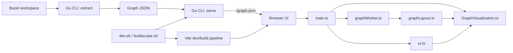

# BuildScope

BuildScope is a local-first Bazel build graph explorer. It extracts dependency graphs from Bazel and renders them in a fast 2D UI for inspection.

## Architecture



For large-graph UX direction, see [docs/large-graph-ui-plan.md](docs/large-graph-ui-plan.md).
For the broader UI/product roadmap, see [docs/ui-vision-roadmap.md](docs/ui-vision-roadmap.md).
For the current implementation brief, see [docs/ui-execution-plan.md](docs/ui-execution-plan.md).

## Prerequisites
- Node.js v24.11.1 (see `.node-version`)
- Go 1.22+
- Bazel workspace (only required for `extract`)

## Quick Start

### Visualize a Bazel target
```bash
# From your Bazel workspace root
/path/to/buildscope/buildscope.sh //your/package:target
```

This extracts the graph, builds the UI if needed, and starts the viewer.

### Development
```bash
# Install UI dependencies
cd ui && npm install && cd ..

# Start dev servers with sample graph
./dev.sh

# Or pass a custom graph
./dev.sh path/to/your/graph.json
```

Default URLs are printed on startup. Ports will fall back if defaults are busy.

## CLI Usage

### Extract a graph
```bash
cd cli
go run ./cmd/buildscope extract \
  -target //your/package:target \
  -workdir /path/to/bazel/workspace \
  -out /tmp/graph.json
```

### Serve a graph
```bash
cd cli
go run ./cmd/buildscope serve \
  -dir ../ui/dist \
  -graph /path/to/your/graph.json \
  -addr :4422
```

## Scripts

### `dev.sh`
Starts:
- Vite dev server (UI)
- Go server (graph API)
- Go file watcher for auto-restart

### `buildscope.sh`
Runs: extract → build UI (if needed) → serve.

### Port overrides
You can override default ports:
```bash
GO_PORT=4500 VITE_PORT=4501 ./dev.sh
SERVER_PORT=4500 ./buildscope.sh //your/package:target
```

## Build
```bash
npm --prefix ui run build
```

## Tests
```bash
cd ui
npm test
```

## Fixture Corpus

BuildScope keeps a pinned fixture corpus so UI and performance changes can be tested against real Bazel graphs.

See [fixtures/README.md](fixtures/README.md) for the full corpus and provenance, then use:

```bash
./scripts/refresh-fixtures.sh
./scripts/benchmark-fixtures.sh
```

Generate and benchmark the large Codex stress fixture when needed:

```bash
./scripts/refresh-fixtures.sh openai_codex_cli
./scripts/benchmark-fixtures.sh openai_codex_cli --include-generated
```

## Repository Structure
- `cli/`: Go CLI (extract/serve)
- `ui/`: TypeScript UI (Pixi.js renderer)
- `scripts/`: Shared script helpers and runners

## Contributing
1) Make a focused change.
2) Run relevant tests.
3) Open a PR with a clear description.
