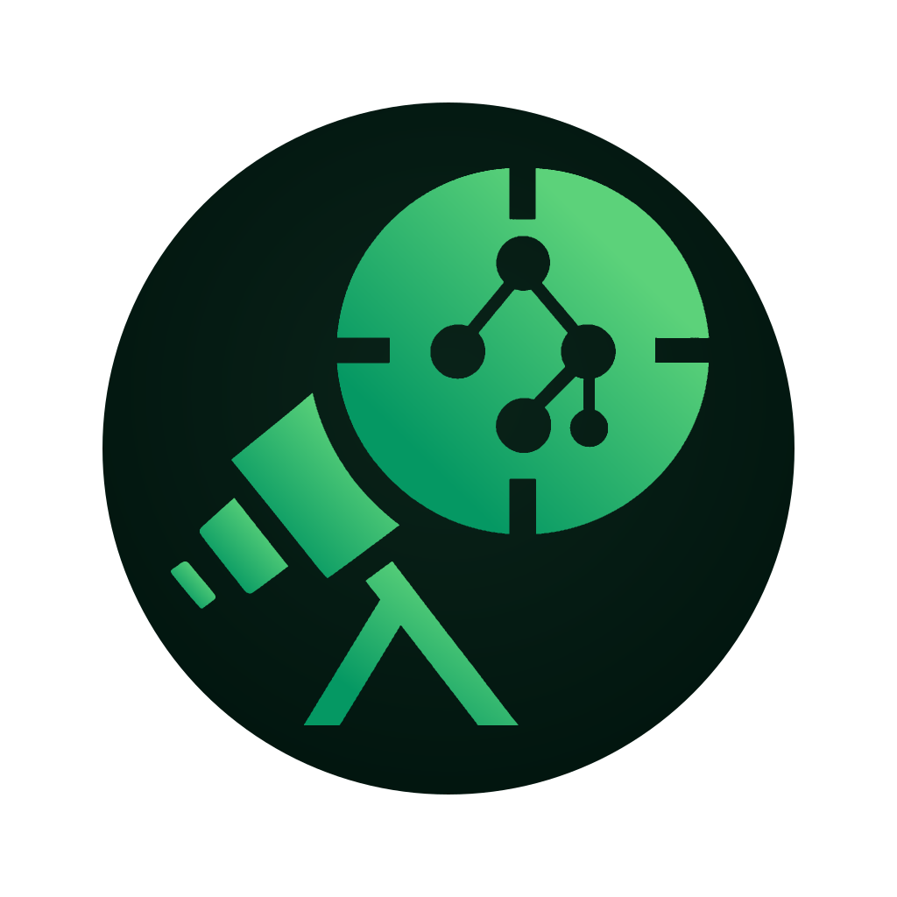
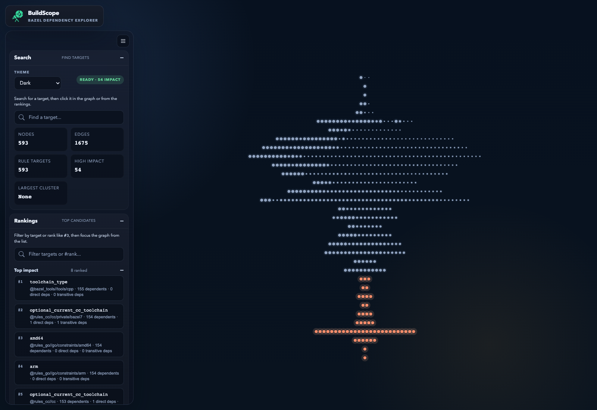
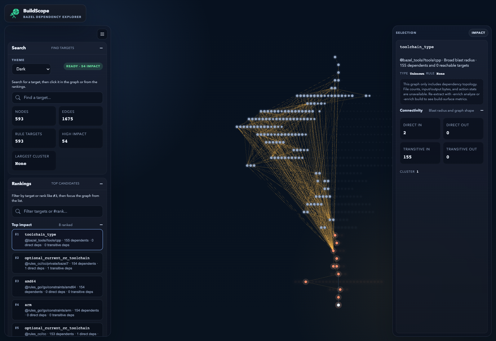
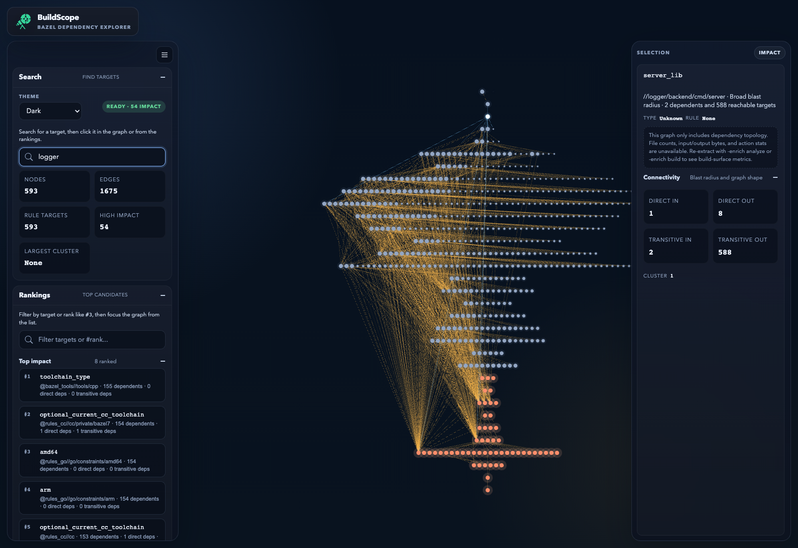

<p align="center">
  
</p>

# BuildScope

BuildScope is a local-first Bazel dependency explorer. Point it at a Bazel target, stream the graph out of `bazel query`, and inspect the result in a fast WebGL UI.

## Why BuildScope

- Runs entirely on your machine. No hosted backend, database, or repo upload.
- Extracts real Bazel dependency graphs instead of relying on hand-built metadata.
- Keeps layout work off the main thread so large graphs stay navigable.
- Ships with a small fixture corpus for repeatable UI and performance checks.

## What Problems It Solves

- Finds high-blast-radius Bazel targets without forcing you to read raw `bazel query` output by hand.
- Surfaces shared hubs and breakup candidates that make a workspace harder to change safely.
- Lets you inspect one target's direct and transitive neighborhood without losing the wider graph context.
- Gives you a repeatable local snapshot you can reopen, search, and compare without rerunning Bazel every time.

## Demo

These screenshots use the checked-in `buildscope_logger` fixture so the flow is reproducible from a fresh checkout.

### 1. Start From The Rankings

BuildScope is most useful when you begin with the ranked summaries instead of exploring the canvas at random. The overview tells you graph size, likely choke points, and whether there are obvious clusters worth drilling into.



### 2. Click Into A High-Impact Target

Selecting a ranked target recenters the graph on that node's neighborhood and updates the side panel with direct and transitive counts. This is the fast path for answering "if I touch this target, how far does the change spread?"



### 3. Search For A Concrete Label

When you already know the target you care about, search is faster than scanning the graph manually. From the focused view you can inspect upstream pressure, downstream reach, and immediate dependencies without losing the surrounding context.



## Install

Choose the path that matches how you plan to use BuildScope. Homebrew is the easiest macOS path, the release installer is the quickest Linux path, and the source install builds the same single-binary app with the UI embedded.

Prerequisites:

- Go `1.22+` to build from source.
- Bazel if you want to extract graphs from a live workspace.
- Node.js is not required to run the installed app.

**macOS**

Install from the Homebrew tap:

```bash
brew tap sharmilajesupaul/buildscope https://github.com/sharmilajesupaul/buildscope
brew install sharmilajesupaul/buildscope/buildscope
```

The release workflow opens a Homebrew formula update PR after each tagged prerelease.

**Linux**

Install the latest prerelease binary into `~/.local/bin`:

```bash
curl -fsSL https://raw.githubusercontent.com/sharmilajesupaul/buildscope/main/scripts/install-release.sh | sh
```

That installs the latest prerelease binary into `~/.local/bin`. Set `VERSION`, `PREFIX`, or `BINDIR` to pin a release or change the install location.

**Build From Source**

Build and install from a repo checkout:

```bash
./install.sh
```

That builds a single Go binary with the UI embedded and installs it into `~/.local/bin`.

You can override the install destination with `PREFIX` or `BINDIR`.

Windows is currently unsupported, and no Windows release artifacts are published right now.

## Quick Start

Once installed, there are three common ways to begin:

- `buildscope demo` to learn the UI on a bundled sample graph
- `buildscope view` to inspect a saved graph snapshot
- `buildscope open` to extract and serve a live Bazel target

Verify the binary and launch the bundled demo:

```bash
buildscope version
buildscope demo
```

Open a pre-generated graph from disk:

```bash
buildscope view /path/to/graph.json
```

Extract and open a live Bazel target from the root of a workspace:

```bash
buildscope open //your/package:target
```

Override the port with `--addr`:

```bash
buildscope open //your/package:target --addr 127.0.0.1:4500
```

If you are running from a repo checkout without installing first, the existing wrapper still works:

```bash
./buildscope.sh //your/package:target
```

## How To Use It
1. Start with `buildscope demo` or `buildscope view /path/to/graph.json` to load a graph and learn the UI on a stable snapshot.
2. Use the ranking lists first instead of panning blindly. `Top impact` answers "what has the biggest blast radius?" and `Break-up candidates` answers "what shared hubs should I split?"
3. Click a ranked target or search for an exact label to focus the canvas on that neighborhood, then switch between `Impact`, `Break-up`, `Upstream`, `Downstream`, and `Direct` depending on the question you are asking.
4. When you want live workspace data, run `buildscope open //your/package:target` or `buildscope extract ...` and reopen the generated graph.

## MCP Server

The installed `buildscope` binary also ships an MCP server over stdio, so AI agents can query the same graph and analysis data without going through the UI.

Recommended setup:

```bash
buildscope view /path/to/graph.json --addr 127.0.0.1:4422
```

Then register exactly one MCP server entry in your client:

```json
{
  "mcpServers": {
    "buildscope": {
      "command": "buildscope",
      "args": ["mcp", "--server", "http://localhost:4422"]
    }
  }
}
```

If you change the port, update the `--server` URL to match.

`buildscope mcp` flags:

| Flag | Use it when | Notes |
| --- | --- | --- |
| `--server <url>` | You already have BuildScope serving `/graph.json` and `/analysis.json` over HTTP | Recommended. Defaults to `http://localhost:4422`. |
| `--graph <path>` | You want MCP to read a saved `graph.json` snapshot directly | Bypasses the HTTP server. |
| `--details <path>` | You also have a matching `graph.details.json` sidecar | Only applies with `--graph`. |

For snapshot mode, repo-checkout usage, and the full MCP tool reference, see [docs/mcp-server.md](docs/mcp-server.md).

Suggested agent instructions:

```text
Use BuildScope to inspect Bazel dependency graphs.
Call get_analysis first to find top impact targets and breakup candidates.
Use exact Bazel labels from that response when calling get_target_details.
If BuildScope is connected to a static graph file, treat the results as a snapshot.
```

## Codex Skill

This repo also ships a Codex skill at `.codex/skills/buildscope-choke-points/` for choke-point and breakup-candidate analysis.

Install it into your Codex home:

```bash
CODEX_HOME="${CODEX_HOME:-$HOME/.codex}"
mkdir -p "$CODEX_HOME/skills"
ln -s /absolute/path/to/buildscope/.codex/skills/buildscope-choke-points \
  "$CODEX_HOME/skills/buildscope-choke-points"
```

If you prefer to copy it instead of symlinking:

```bash
CODEX_HOME="${CODEX_HOME:-$HOME/.codex}"
mkdir -p "$CODEX_HOME/skills"
cp -R /absolute/path/to/buildscope/.codex/skills/buildscope-choke-points \
  "$CODEX_HOME/skills/buildscope-choke-points"
```

Suggested Codex instructions:

```text
Use the buildscope-choke-points skill when inspecting a running BuildScope server or a saved graph.json file.
Prefer /analysis.json first, then inspect /graph.details.json for direct inputs and outputs when available.
If BuildScope is running on a custom port, use that exact port when you connect to it.
```

For the full MCP quickstart, tool list, and examples, see [docs/mcp-server.md](docs/mcp-server.md).

## Release Versioning

BuildScope is currently pre-1.0. Use tags in the `v0.1.x` series for releases.

Example:

```bash
git tag v0.1.0
git push origin v0.1.0
```

That tag triggers the GitHub release workflow to:

- run the frontend and Go test suites
- publish versioned release assets for macOS and Linux on `amd64` and `arm64`
- publish stable `latest` asset aliases for scripted Linux installs
- mark the GitHub release as a prerelease because the tag is still under `v1`
- open a PR that updates the Homebrew formula

## Development

Frontend development prerequisites:

- Node.js `24.11.1` or newer
- Go `1.22+`

Prepare the repo:

```bash
./setup.sh
```

Start the local development stack:

```bash
./dev.sh
```

Or point the UI at a specific graph JSON file:

```bash
./dev.sh path/to/graph.json
```

Direct commands:

```bash
npm --prefix ui run dev
npm --prefix ui run build
npm --prefix ui test
cd cli && go test ./...
```

Ports can be overridden with `GO_PORT`, `VITE_PORT`, and `SERVER_PORT`.

If you change the shipped UI and want the standalone binary to pick it up, refresh the embedded bundle:

```bash
./scripts/refresh-embedded-ui.sh
```

Build a release archive locally:

```bash
./scripts/build-release.sh v0.1.0 darwin arm64 dist
```

## Startup Paths

Installed CLI:

```bash
buildscope demo
buildscope view /tmp/graph.json
buildscope open //your/package:target
```

Repo checkout helpers:

```bash
./setup.sh
./dev.sh
./buildscope.sh //your/package:target
```

## How It Gets The Graph

The extraction path is the `extract` command:

```bash
buildscope extract \
  -target //your/package:target \
  -workdir /path/to/bazel/workspace \
  -out /tmp/graph.json \
  -enrich analyze
```

Under the hood, that command shells out to:

```bash
bazel query 'deps(//your/package:target)' --output=graph --keep_going
```

BuildScope streams Bazel's graph output, joins optional metadata from `label_kind` and `cquery`, and writes a versioned JSON graph:

```json
{
  "schemaVersion": 2,
  "analysisMode": "analyze",
  "detailsPath": "graph.details.json",
  "nodes": [
    {
      "id": "//app:bin",
      "label": "//app:bin",
      "nodeType": "rule",
      "ruleKind": "go_binary",
      "sourceFileCount": 4,
      "sourceBytes": 18240,
      "inputFileCount": 5,
      "inputBytes": 20384,
      "outputFileCount": 1,
      "outputBytes": 0,
      "actionCount": 6
    },
    {
      "id": "//lib:core",
      "label": "//lib:core",
      "nodeType": "rule"
    }
  ],
  "edges": [
    { "source": "//app:bin", "target": "//lib:core" }
  ]
}
```

When details are available, BuildScope also writes a sibling `graph.details.json` file with full direct input lists, output lists, and action mnemonic summaries per target.

The full Bazel extraction and BuildScope analysis flow now lives in [docs/bazel-graph-flow.md](docs/bazel-graph-flow.md).

That doc shows the exact extraction flow, the Bazel commands used for topology and metadata, and the worker-side steps that turn the enriched graph into high-impact targets, source-heavy targets, output-heavy targets, and break-up candidates.

For the Go server's local HTTP surface, including `/graph.json` and `/analysis.json`, see [docs/backend-api.md](docs/backend-api.md).

## Fixture Corpus

BuildScope keeps a small fixture corpus in-repo so UI changes and layout changes can be checked against repeatable graphs instead of ad hoc screenshots. The corpus now includes enriched fixtures with sibling `*.details.json` files for direct inputs, outputs, and action summaries, alongside a couple of older topology-only snapshots kept for stress comparisons.

See [fixtures/README.md](fixtures/README.md) for the corpus and refresh workflow.

## Repository Layout

- `cli/` Go CLI for graph extraction and local serving
- `cli/internal/embeddedui/` committed UI bundle embedded into the Go binary
- `ui/` TypeScript frontend and Pixi.js renderer
- `fixtures/` checked-in sample graphs and fixture metadata
- `scripts/` helper scripts for local development and fixture maintenance

## Contributing

Keep changes focused, run the relevant checks, and include enough context in a PR for someone new to the project to understand the user-facing impact.
