<p align="center">
  
</p>

# BuildScope

BuildScope is a local-first Bazel dependency explorer. Point it at a Bazel target, stream the graph out of `bazel query`, and inspect the result in a fast WebGL UI.

## Why BuildScope

- Runs entirely on your machine. No hosted backend, database, or repo upload.
- Extracts real Bazel dependency graphs instead of relying on hand-built metadata.
- Keeps layout work off the main thread so large graphs stay navigable.
- Ships with a small fixture corpus for repeatable UI and performance checks.

## Quick Start

From the root of a Bazel workspace:

```bash
/path/to/buildscope/buildscope.sh //your/package:target
```

That command:

1. runs the graph extraction step against your current workspace
2. builds the UI if needed
3. starts the local viewer on `http://localhost:4422` by default

Override the port with `SERVER_PORT` if needed:

```bash
SERVER_PORT=4500 /path/to/buildscope/buildscope.sh //your/package:target
```

## How It Gets The Graph

The core extraction path is the `extract` command:

```bash
cd cli
go run ./cmd/buildscope extract \
  -target //your/package:target \
  -workdir /path/to/bazel/workspace \
  -out /tmp/graph.json
```

Under the hood, that command shells out to:

```bash
bazel query 'deps(//your/package:target)' --output=graph --keep_going
```

BuildScope streams Bazel's graph output, converts it into a plain JSON shape, and writes:

```json
{
  "nodes": [
    { "id": "//app:bin", "label": "//app:bin" },
    { "id": "//lib:core", "label": "//lib:core" }
  ],
  "edges": [
    { "source": "//app:bin", "target": "//lib:core" }
  ]
}
```

The full data and analysis path looks like this:

```mermaid
flowchart LR
  A["User runs buildscope open or buildscope extract"]
  B["Go CLI validates Bazel workspace<br/>WORKSPACE, WORKSPACE.bazel, or MODULE.bazel"]
  C["Run Bazel query<br/>deps(target) with graph output"]
  D["Streaming parser reads Graphviz-style query output<br/>and dedupes labels and edges into graph JSON"]
  E["Write graph.json"]
  F["Go HTTP server serves UI and /graph.json"]
  G["Frontend fetches graph"]
  H["Worker sanitizes invalid ids and edges"]
  I["Compute degrees and transitive reachability"]
  J["Run Tarjan SCC pass to find cycles / tightly coupled clusters"]
  K["Mark high-impact targets<br/>cycles become hotspots; DAG nodes with unusually high transitiveInDegree are also ranked"]
  L["Score break-up candidates<br/>log2(transitiveInDegree + 1) x max(1, outDegree)"]
  M["Build layered / compact layout"]
  N["Pixi.js renders graph and analysis panels"]
  O["UI shows Top impact and Break-up candidates"]

  A --> B --> C --> D --> E --> F --> G --> H --> I --> J --> K --> L --> M --> N --> O
```



After `/graph.json` is loaded, the frontend worker does more than layout:

- High-impact targets are ranked mostly by `transitiveInDegree`, which answers "how many targets depend on this one?" Cycles are detected via strongly connected components, and those cyclic clusters are promoted as hotspots immediately.
- For mostly acyclic Bazel graphs, the worker still marks unusually shared nodes as hotspots by looking at the top 10% of `transitiveInDegree` values, so common libraries still stand out even when there are no cycles.
- Break-up candidates use the `pressure` score: `log2(transitiveInDegree + 1) * max(1, outDegree)`. That favors broad shared hubs that also fan out into many dependencies, which makes them better refactor targets than leaf libraries with the same number of dependents.

The viewer then uses those precomputed metrics to power the `High impact ranking` and `Break-up candidates` modes in the UI.

## Development

Prerequisites:

- Node.js `24.11.1` or newer
- Go `1.22+`
- Bazel, if you want to extract graphs from a live workspace

Install UI dependencies:

```bash
npm --prefix ui install
```

Start the local development stack:

```bash
./dev.sh
```

Or point the UI at a specific graph JSON file:

```bash
./dev.sh path/to/graph.json
```

Direct commands:

```bash
npm --prefix ui run dev
npm --prefix ui run build
npm --prefix ui test
cd cli && go test ./...
```

Ports can be overridden with `GO_PORT`, `VITE_PORT`, and `SERVER_PORT`.

## Fixture Corpus

BuildScope keeps a small fixture corpus in-repo so UI changes and layout changes can be checked against repeatable graphs instead of ad hoc screenshots.

See [fixtures/README.md](fixtures/README.md) for the corpus and refresh workflow.

## Repository Layout

- `cli/` Go CLI for graph extraction and local serving
- `ui/` TypeScript frontend and Pixi.js renderer
- `fixtures/` checked-in sample graphs and fixture metadata
- `scripts/` helper scripts for local development and fixture maintenance

## Contributing

Keep changes focused, run the relevant checks, and include enough context in a PR for someone new to the project to understand the user-facing impact.
