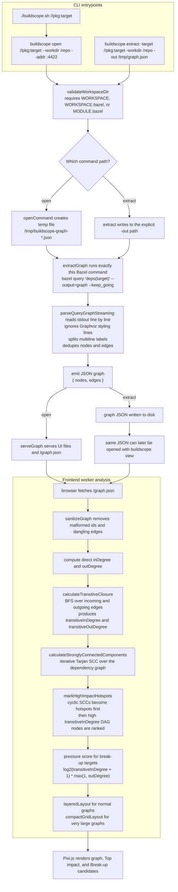

# Bazel Graph Extraction And Analysis Flow

BuildScope uses Bazel for one thing: extracting the raw dependency graph for a target. The higher-level analysis for hotspots, high-impact targets, and break-up candidates is computed locally after that graph has been loaded into the UI.

For the exact HTTP surface exposed by the Go server, including `/graph.json`, `/analysis.json`, query params, and example `curl` calls, see [backend-api.md](backend-api.md).



## What Bazel Does

- BuildScope validates that the working directory is a Bazel workspace by checking for `WORKSPACE`, `WORKSPACE.bazel`, or `MODULE.bazel`.
- The shared extraction path is `extractGraph`, which runs `bazel query 'deps(<target>)' --output=graph --keep_going`.
- Bazel emits Graphviz-style output. BuildScope does not ask Bazel for hotspot scores, SCCs, or refactor suggestions.

## What BuildScope Does After Bazel

- `parseQueryGraphStreaming` consumes Bazel stdout incrementally so large graphs do not have to be buffered in memory first.
- The parser skips Graphviz styling directives like `node` and `edge`, splits multiline labels, and deduplicates nodes and edges into a plain `{ nodes, edges }` JSON payload.
- `buildscope open` writes that JSON to a temp file and serves it immediately. `buildscope extract` writes the same JSON shape to the user-specified `-out` path.

## How High-Impact Targets Are Detected

- After the browser loads `/graph.json`, the frontend worker sanitizes invalid ids and dangling edges.
- The worker computes direct `inDegree` and `outDegree`, then runs BFS over incoming and outgoing edges to compute `transitiveInDegree` and `transitiveOutDegree`.
- The worker runs iterative Tarjan SCC detection to find strongly connected components.
- Cyclic SCCs are promoted to hotspots first because they represent tightly coupled clusters.
- For mostly acyclic Bazel graphs, the worker also promotes unusually shared nodes using the upper slice of `transitiveInDegree`, so widely reused libraries still surface as high-impact targets.

## How Break-Up Targets Are Detected

- Break-up candidates are derived from the local `pressure` score:

```text
log2(transitiveInDegree + 1) * max(1, outDegree)
```

- That scoring intentionally favors targets that are both widely depended on and directly connected to many downstream dependencies.
- In practice, this pushes broad shared hubs above simpler leaf libraries, which makes the list more useful for refactoring and dependency breakup work.

## Summary

Bazel gives BuildScope the exact dependency edges. BuildScope then adds the graph algorithms and scoring needed to answer two different questions:

- Which targets are most central or high impact?
- Which shared hubs are the best break-up or refactor candidates?
