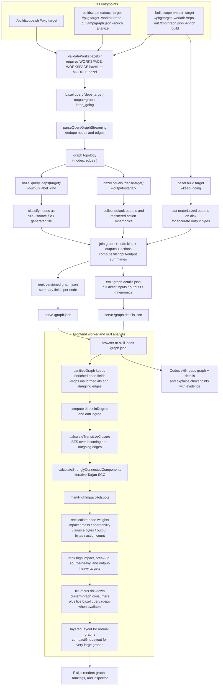

# Bazel Graph Extraction And Analysis Flow

BuildScope now uses Bazel for two layers of data:

- the raw dependency graph for a target
- optional per-target metadata about file surface, generated outputs, and action structure
- optional live reverse-dependency drill-downs for a focused file when the server was started from a real Bazel workspace

The higher-level analysis for hotspots, source-heavy targets, output-heavy targets, and break-up candidates is still computed locally after the graph has been loaded into the UI or the Codex skill.

For the exact HTTP surface exposed by the Go server, including `/graph.json`, `/analysis.json`, query params, and example `curl` calls, see [backend-api.md](backend-api.md).



## What Bazel Does

- BuildScope validates that the working directory is a Bazel workspace by checking for `WORKSPACE`, `WORKSPACE.bazel`, or `MODULE.bazel`.
- `bazel query 'deps(<target>)' --output=graph --keep_going` emits the dependency topology.
- `bazel query 'deps(<target>)' --output=label_kind` classifies labels as rules, source files, or generated files.
- `bazel cquery 'deps(<target>)' --output=starlark` exposes configured target outputs and registered action mnemonics.
- In `-enrich build` mode, `bazel build <target> --keep_going` materializes outputs so BuildScope can stat them and compute output bytes.
- When the server is running against a live workspace, targeted reverse-dependency drill-downs can also use `bazel query "rdeps(//..., <file>)"` on demand for one file label at a time.

## What BuildScope Does After Bazel

- `parseQueryGraphStreaming` consumes Bazel stdout incrementally so large graphs do not have to be buffered in memory first.
- The extractor joins topology, node-kind classification, configured outputs, and action mnemonics into enriched per-node summaries.
- Rule targets get rolled-up metrics such as direct source file count, source bytes, direct input file count, input bytes, default output count, output bytes, and action count.
- `graph.json` carries node summaries for rendering and rankings. `graph.details.json` carries the larger direct input / output / mnemonic lists for the inspector and Codex skill.
- `/file-focus.json` layers file-centric consumer analysis on top of the same served graph, and optionally augments it with live workspace reverse dependencies.

## How High-Impact Targets Are Detected

- After the browser or skill loads `/graph.json`, the analysis code sanitizes invalid ids and dangling edges while preserving enriched fields.
- The worker computes direct `inDegree` and `outDegree`, then runs BFS over incoming and outgoing edges to compute `transitiveInDegree` and `transitiveOutDegree`.
- The worker still runs iterative Tarjan SCC detection defensively, but Bazel target graphs are usually acyclic, so SCCs are rarely the deciding breakup signal.
- For Bazel DAGs, the worker promotes unusually shared nodes using the upper slice of `transitiveInDegree`, so widely reused libraries still surface as high-impact targets.

## How Break-Up Targets Are Detected

- BuildScope still emits the legacy `pressure` score for compatibility, but breakup ranking is now driven by a heavier-weight opportunity model:

```text
opportunityScore = impactScore * massScore * shardabilityScore
```

- `impactScore` captures downstream blast radius.
- `massScore` captures build-heavy surface such as actions, bytes, and file counts.
- `shardabilityScore` captures structural breadth plus dependency-package diversity.
- Stable shared leaves are explicitly demoted when they are central but still light and structurally narrow.

## How File Drill-Down Works

- The served graph already records file nodes, direct file inputs, and per-target top files.
- `/file-focus.json?label=//pkg:file.go` computes direct and transitive consumers of that file within the current graph snapshot.
- When the server was started with `buildscope //your/package:target`, `buildscope extract-view`, or `buildscope open`, BuildScope also runs `bazel query "rdeps(//..., <file>)"` on demand so Codex and other clients can distinguish local graph consumers from whole-workspace reverse dependencies.

## Summary

Bazel gives BuildScope the dependency graph and the raw metadata needed to size targets by more than just degree. BuildScope then adds the graph algorithms and scoring needed to answer four questions:

- Which targets are most central or high impact?
- Which shared hubs are the best break-up or refactor candidates?
- Which targets carry the largest direct source or input surface?
- Which targets produce the largest output surface or action footprint?
- Which files are actually pulling high-opportunity targets into a rebuild path?
